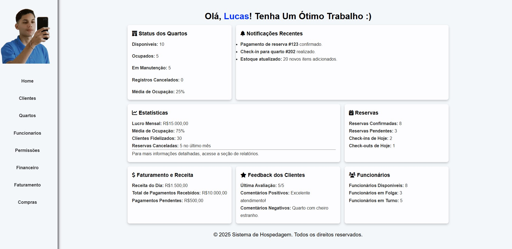

# 🏨 Hosting System V1

    

**Status:** 🚧 Pré-Alfa  

O **Hosting System V1** é um sistema de gerenciamento para hospedagens, desenvolvido em **PHP** com uma estrutura modular e dinâmica. O projeto ainda está em fase **pré-alfa**, e várias funcionalidades serão adicionadas ao longo do tempo.

## 🔧 Tecnologias Utilizadas

- **PHP** para o back-end
- **MySQL** para o banco de dados 
- **HTML, CSS e JavaScript** para a interface

## 📌 Funcionalidades Atuais

✔️ Estrutura de roteamento dinâmica  
✔️ Sidebar para navegação entre módulos  
✔️ Organização modular dos arquivos  
✔️ Integração inicial com MySQL  

## 🚀 Funcionalidades em Desenvolvimento

🔹 Segurança e autenticação de usuários  
🔹 Formulários completos e validações  
🔹 Melhorias no design e experiência do usuário  
🔹 Implementação completa e melhorias do banco de dados 
🔹 Dashboard interativo  

